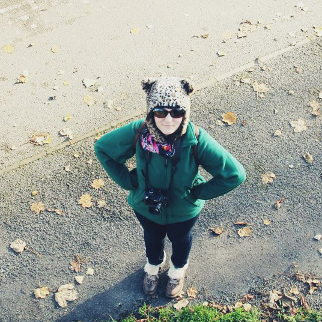

Han is a tea loving femgeek currently working as a frontend developer. Having previously worked as a PHP developer and designer. She enjoys gaming on all platforms, drinking tea, eating vegetables, vintage shopping, designing websites, developing applications, photography and doting on her guinea pigs. This site is her main blog. It could be described as a lifestyle blog. Han started her first ‘site’ in 2001, a graphics site and began blogging shortly afterwards. Buying her first domain and hosting on May 22, 2004. In fact some of that sites content still exists on this site today, with only marginally better spelling.Han’s blogs have received various forms of recognition though the years, in the form of awards, design features and newspapers*.

*[Han] there is proof, honest. I never did get a copy of that metro article though.

If you’d like to get in touch please do! There are more ways to get in contact with me below.

* [Twitter](https://twitter.com/apricot_13)
* [Instagram](https://www.instagram.com/apricot13/)
* [Guinea pig instagram](https://www.instagram.com/fluffytrundlers/)
* [Pinterest](https://www.pinterest.co.uk/apricot13/_created/)
* [Goodreads](https://www.goodreads.com/user/show/258736-han)
* [VSCO](https://vsco.co/apricot13/gallery)
* [Github](https://www.github.com/apricot13)