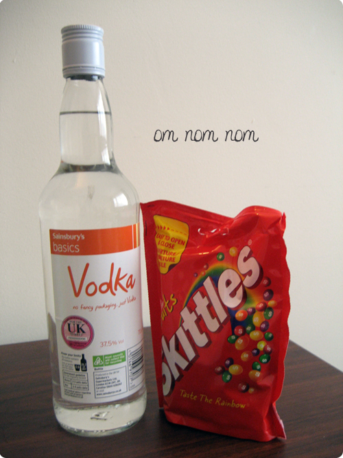
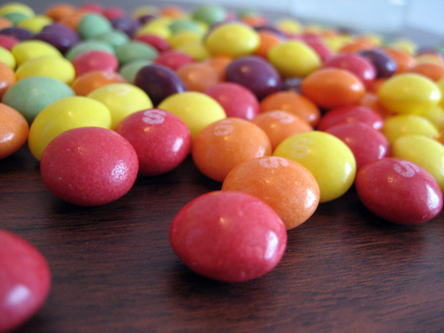
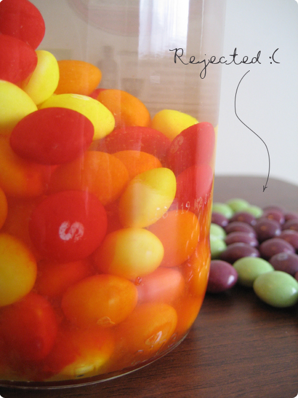
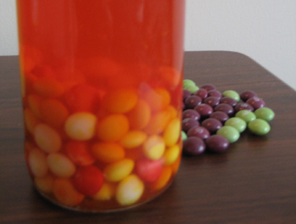

Its my friends birthday on Saturday night so I decided to make my own ‘cocktail’. Which is essentially skittles in a bottle of vodka!

Take one cheap bottle of vodka:

and lots of skittles:

Separate all the purple and green ones – because they make it bitter, And add the remaining ones to the bottle.

They all dissolve into this:

I have a feeling tomorrow night could be messy!