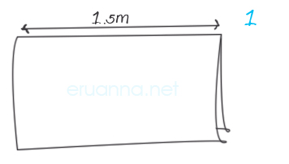
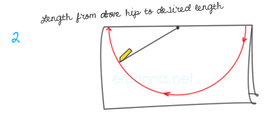
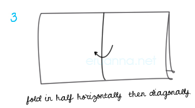
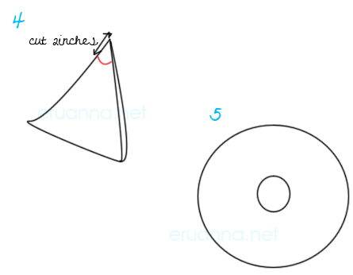

Making a skirt, no sewing required!

\1. Buy a length of material from a fabric shop – it can be whatever you want. I bought a metre and a half just to be sure I had the right amount.

Lay out the material and fold it lengthways so you have a long thin rectangle

\2. Measure using a piece of string from above your hips (the widest bit) to wherever you want the skirt to end.

Tie the piece of string to a pen/pencil/fabric marker and starting where you know the pen wont go over the edges of the material draw a semi circle.

Cut along this line – you now have a circle – but don’t unfold it yet!

\3. Fold the circle in half vertically and then diagonally.

\4. Cut a rounded quarter circle about 2inches from the point of the folded fabric – you should have two concentric circles.

Then all you need to do is force yourself into it – head first! You may need to make a slight rip in the waist to get in but once you’ve done that it’s easy enough to get in and out of it!