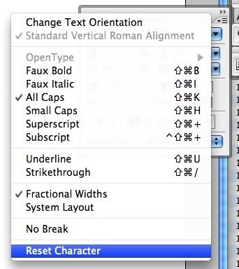

This is one of the most invaluable things I’ve learnt about photoshop!

When your working on a design and you want to try out a particular font the last thing you want to do is close Photoshop and reopen it this little trick will let you reset your fonts and add any new ones you’ve installed to the font list.

I always start a new text layer – otherwise your current paragraph/character settings are lost. (press T and click anywhere on the document) then go to Window > Character

Click the little icon with the three lines and the down arrow in the top right hand corner of the Character Pallet, then select Reset Character and all your new fonts will be added to the list!
