I had a little accident with the fridge door the other day and accidentally dropped all our eggs on the floor! “Bugger!” I said, I wanted pancakes!

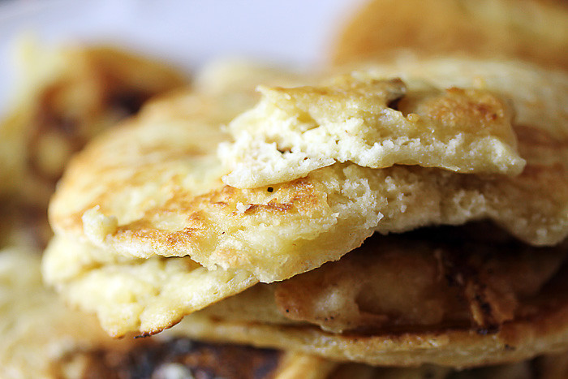

I didn’t find a proper eggless recipe, by which I mean the thin tasty english/french (Crepe) style pancakes but I did find this recipe, which turned out very well indeed!

The recipe is adapted from [here](http://www.grouprecipes.com/58293/fluffy-eggless-pancakes.html).

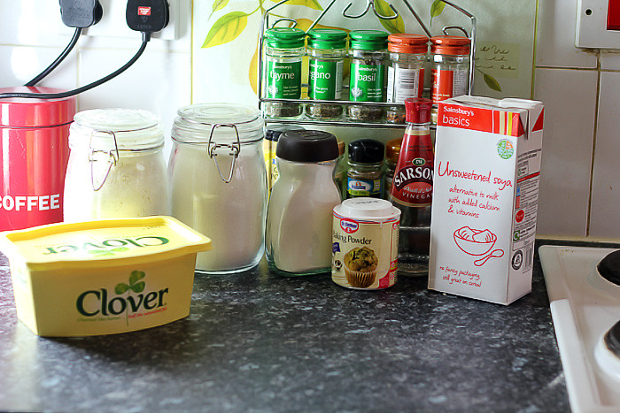

**The ingredients.**
This makes a LOT of pancakes, it says 6 but its nearer 8 if you ask me!, I’d suggest halving it if you can!

- 1 1/2 cups flour
- 4 tsp baking powder
- 1 tsp salt
- 1 tbsp sugar
- 1 tsp white vinegar (I used malt!)
- 4 tbsp melted butter
- 1 1/3 cups milk (I used soya – [because it doesn’t contain pus](http://www.vegetarian.org.uk/mediareleases/060524a.html))

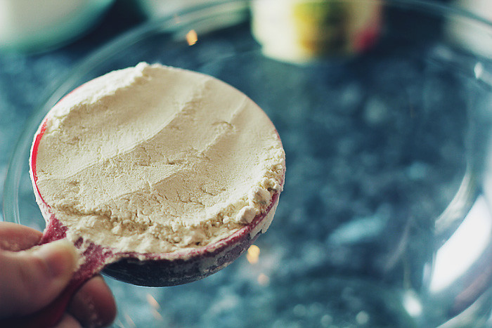
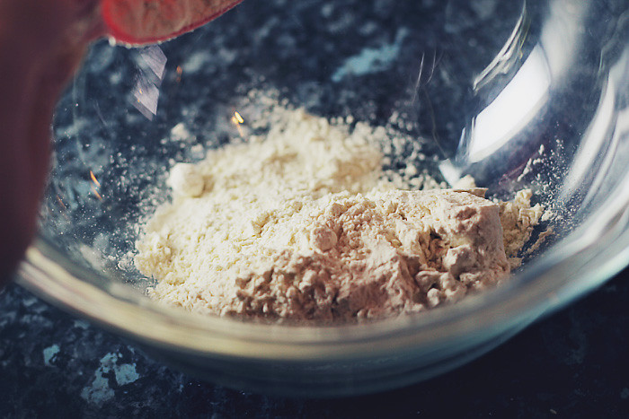
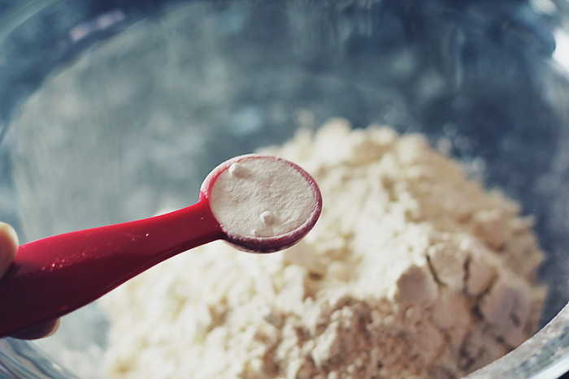
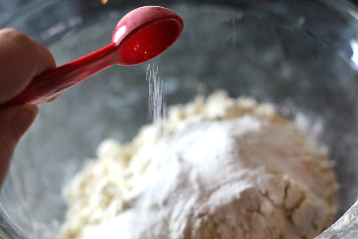
Add the flour, baking powder, salt and sugar to a large glass bowl.

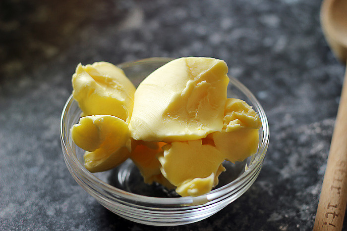
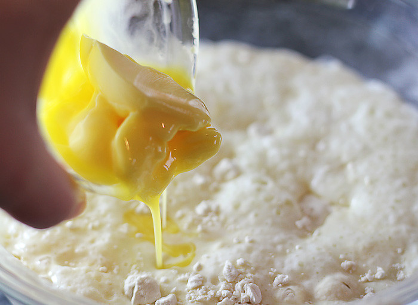
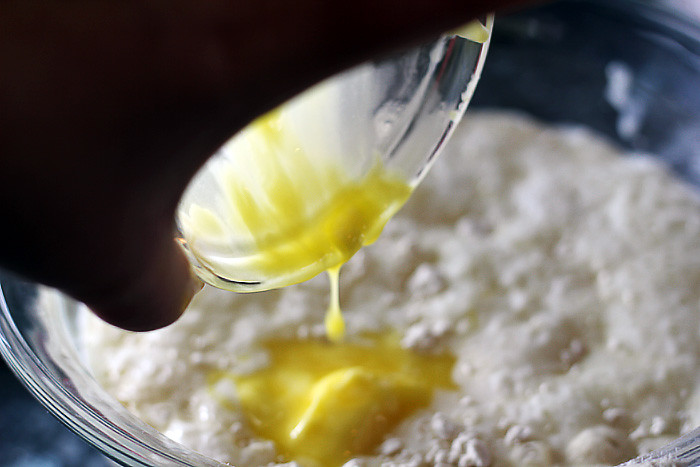
Add the melted butter

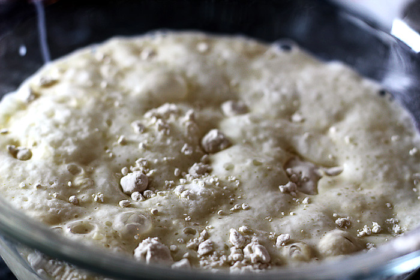
And the vinegar and watch it sizzle!

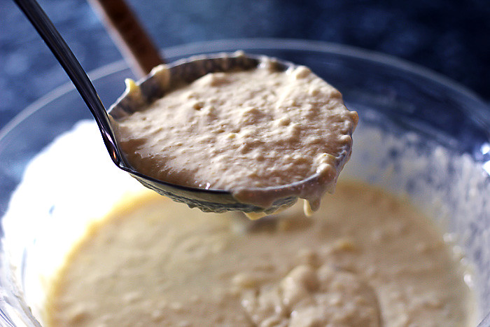
Grab a ladle full of mixture (mix it a bit better than I have though!)

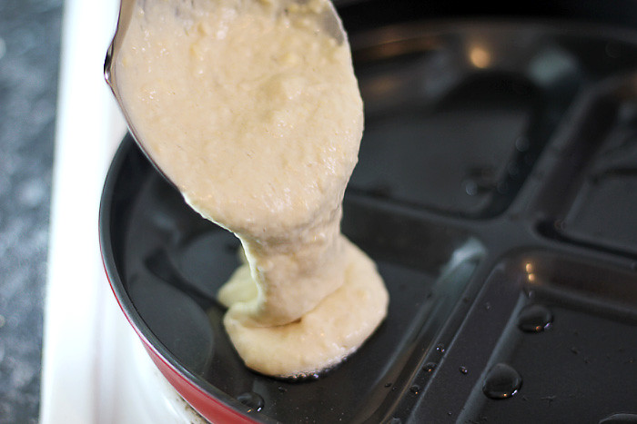
and pour it onto a hot oiled pan.

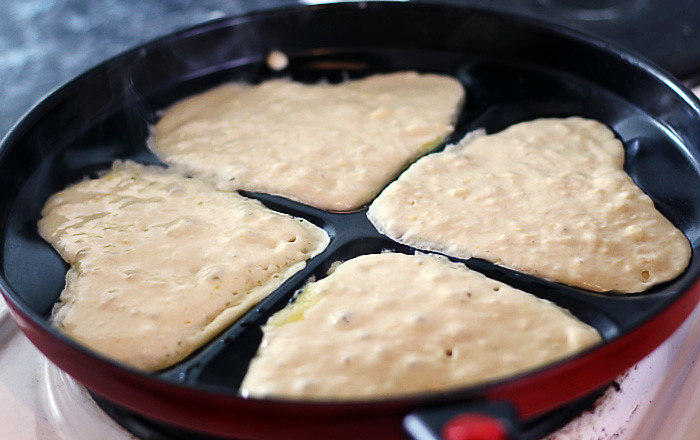
When they’re golden on one side, flip them over

and enjoy with a whole load of chocolate spread and maple syrup!