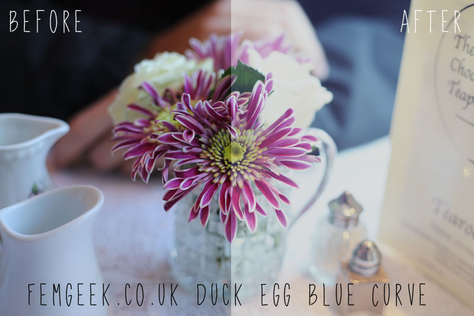
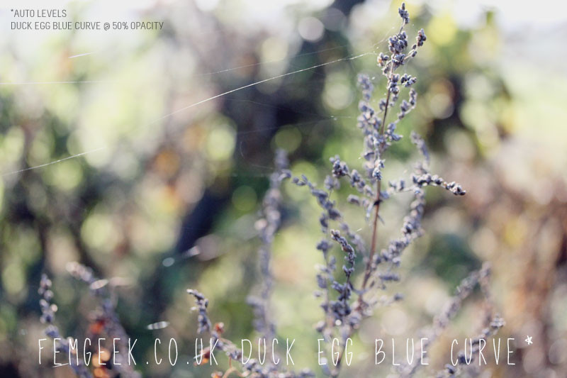
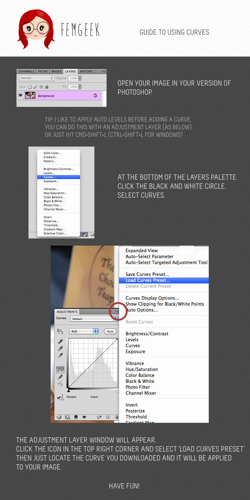

 

or is that day 12?

Are you all set for day 1 or 12.. of the 12 days of femgeek christmas!?

 

I thought it was about time I shared some freebies on this blog. I wasn’t really sure what to give away to you guys because my blog is a little all over the place but I hope i’ve covered all my bases.

 

When you use any of the freebies I’d really appreciate a link back to [femgeek.co.uk](http://www.femgeek.co.uk/). If you would like to, you can also follow me on [twitter](https://twitter.com/apricot_13). You can also add femgeek on [facebook](https://www.facebook.com/femgeek.co.uk) and [google+ pages](https://plus.google.com/110396807693668334198/posts).

 

It would be great if you could tweet/facebook/google plus about the 12 days too!

> Just downloaded a free Photoshop Curve from femgeek.co.uk download it here: http://bit.ly/U0Js5s #12daysoffemgeekchristmas from @apricot_13

 

 

A photoshop curve that gives your images a duck egg blue hue. Works best on images that contain green and blue hues.

 
**Click the 'download' button on the top right hand corner above where it says 'View raw'**

 

 

Don’t know how to install or use this download? Don’t worry, I created a little guide to help you. But if you run into any trouble [tweet](https://www.twitter.com/apricot_13) or [email me](http://www.femgeek.co.uk/contact) and I’ll try to help.

 

 

