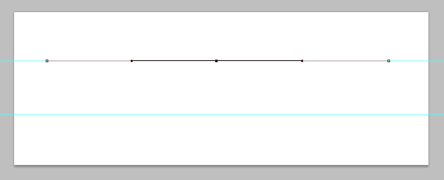

 

**Updated 28/12/2013:** I’ve added a gif to help explain the pen tool steps a bit better!

Day 3 of the 12 days of Femgeek Christmas!

When you use any of the freebies I’d really appreciate a link back to [femgeek.co.uk](http://www.femgeek.co.uk/). If you would like to, you can also follow me on [twitter](https://twitter.com/apricot_13). You can also add femgeek on [facebook](https://www.facebook.com/femgeek.co.uk) and [google+ pages](https://plus.google.com/110396807693668334198/posts).

 

It would be great if you could tweet/facebook/google plus about the 12 days too!

> Just created some digital bunting from femgeek.co.uk download it here: http://bit.ly/WZ3jTK #12daysoffemgeekchristmas from @apricot_13

Today we’re going to learn how to make some digital bunting.
You can download the brushes used in this tutorial [here](http://www.femgeek.co.uk/12-days-of-femgeek-christmas-fairy-dust-brushes/).
All the stock images used are from [sxc.hu](http://www.sxc.hu/).

First create a new document. 851 x 315 px.

Then hit cmd + R (ctrl + R) to enable rules. Drag two rulers to divide the canvas into thirds

Select the pen tool. At the top of the screen select the ‘paths’ option and create a new layer.

Using the pen tool create a straight line from where you want your bunting to start and end. Click once on the left, then click once on the right. Then move your cursor to the middle of your line and a little + icon will popup next to your cursor. Click. Then with your mouse still near that point hold down cmd (ctrl) and drag down.

Dragging the middle point down will create the curve you will base your bunting on.

 

Select a 1px black brush. Open the Paths panel and click the hollow circle to stroke the path you just created.

Select the pen tool again and at the top again select shape layers.

Then create a triangle shape. This will be the shape of your bunting.

Once you have your shape duplicate your layer along the guide path you created.

Open your first stock image and paste it on top of your first triangle shape. Right click the layer and select ‘Create Clipping Mask’.

Repeat the process for all your triangles.

and Tada, theres your bunting 

If you want you can use the [fairy dust brushes](http://www.femgeek.co.uk/12-days-of-femgeek-christmas-fairy-dust-brushes/) from yesterday to create your background.

You can download the PSD for this tutorial below.

**Click the 'download' button on the top right hand corner above where it says 'View raw'**

Take a look at what people are doing with the tutorial below:

