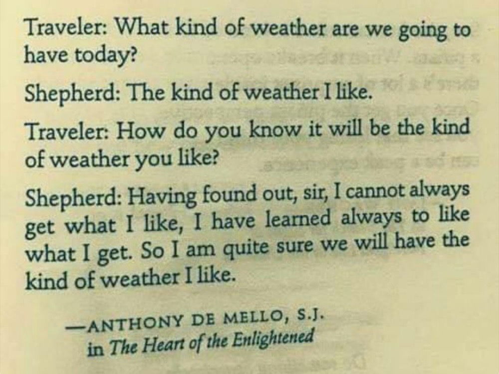
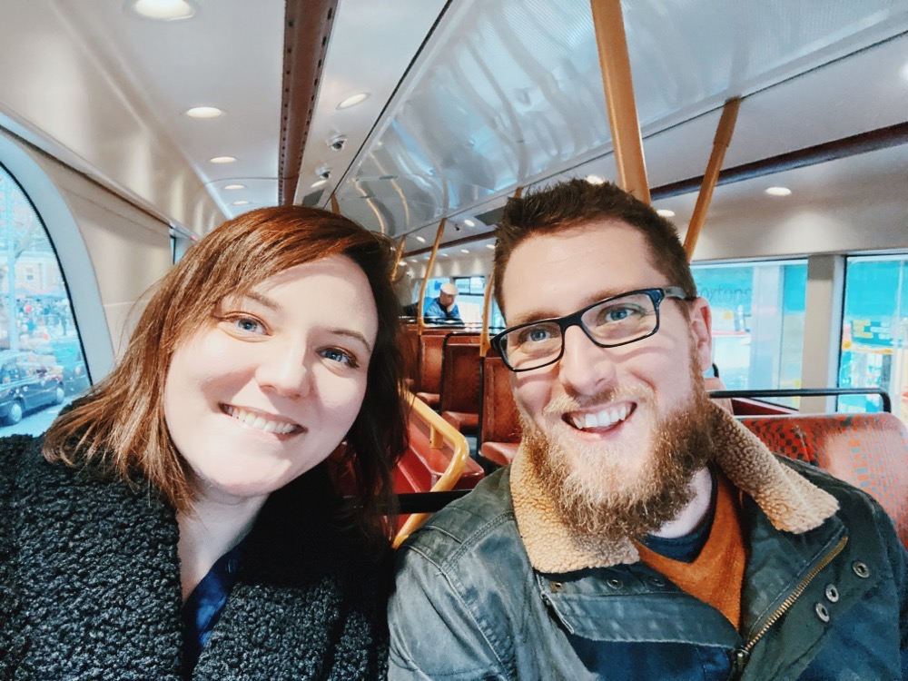
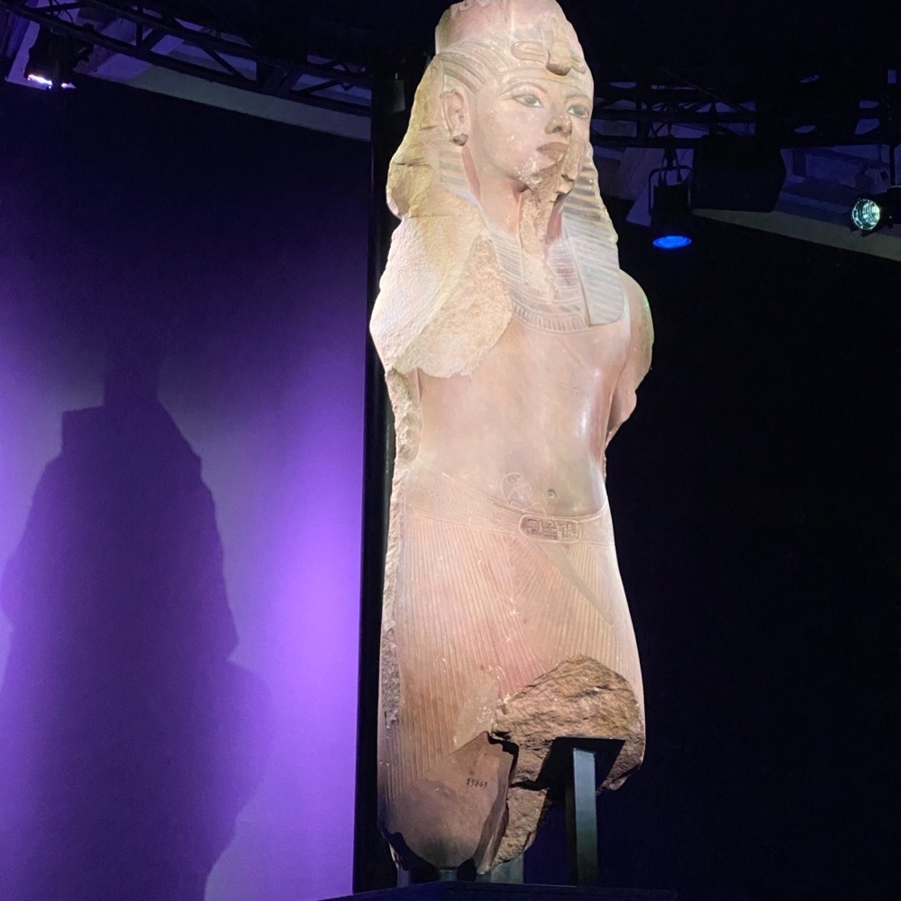
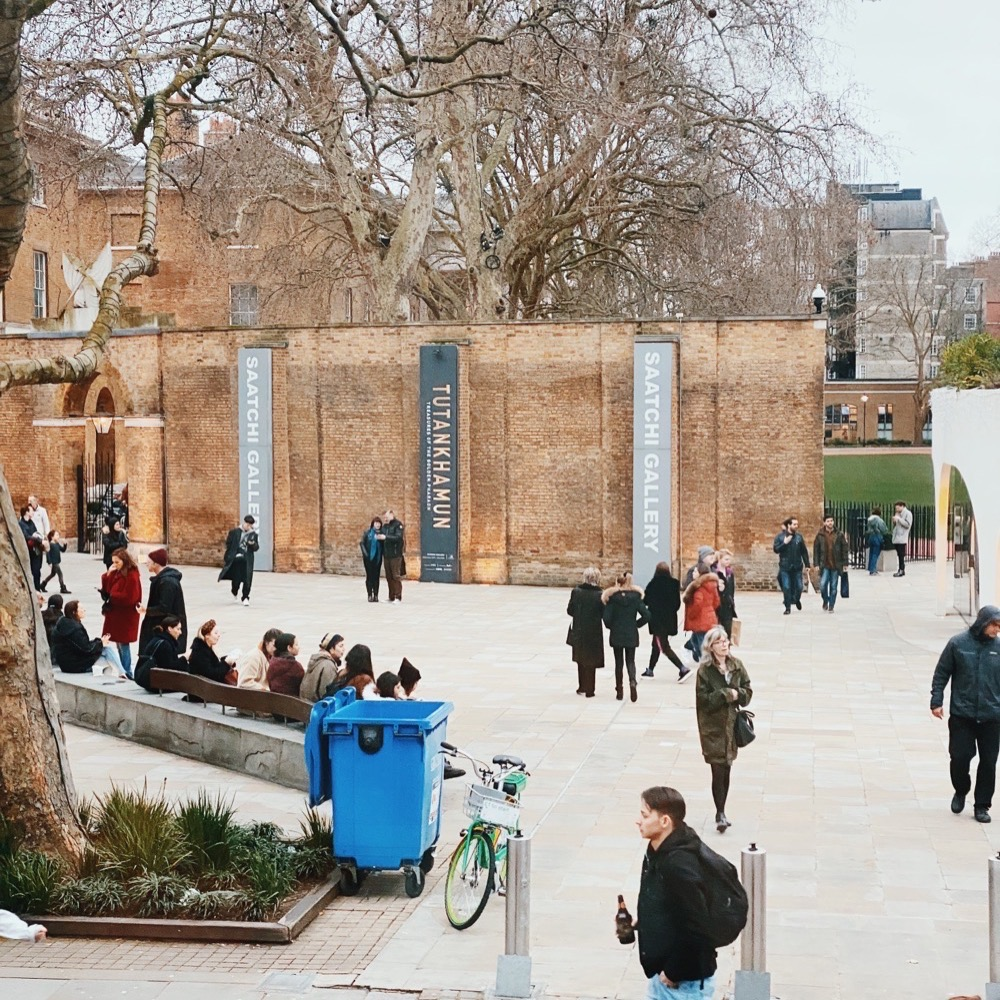
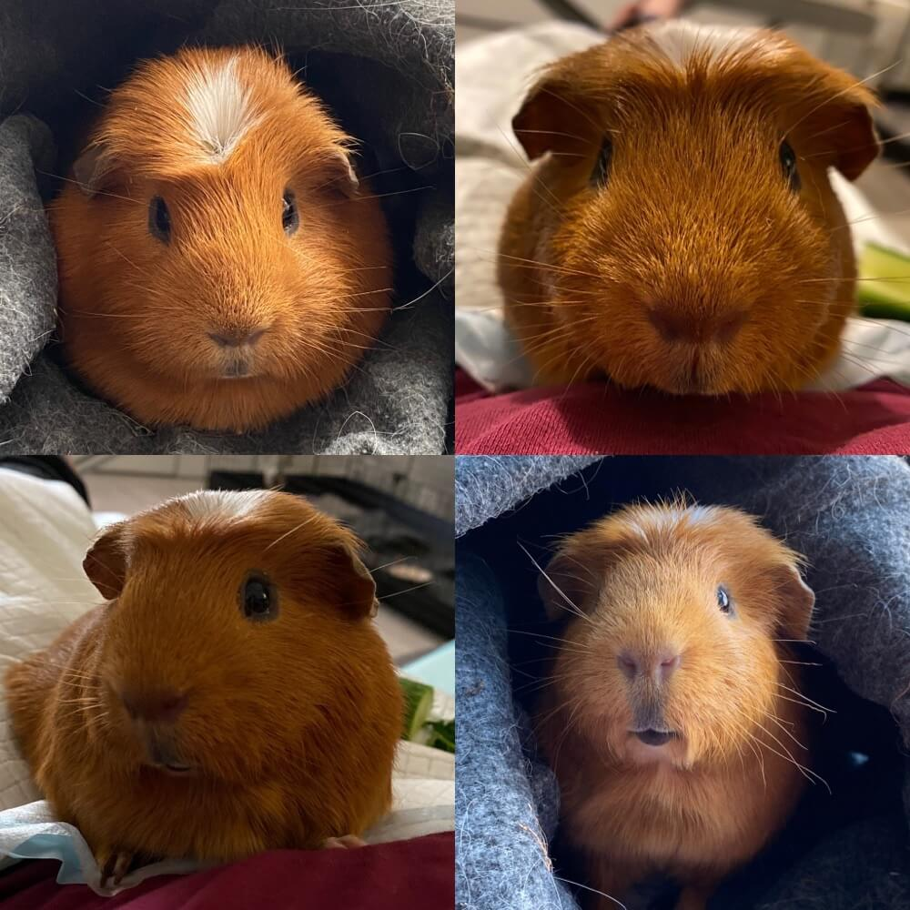
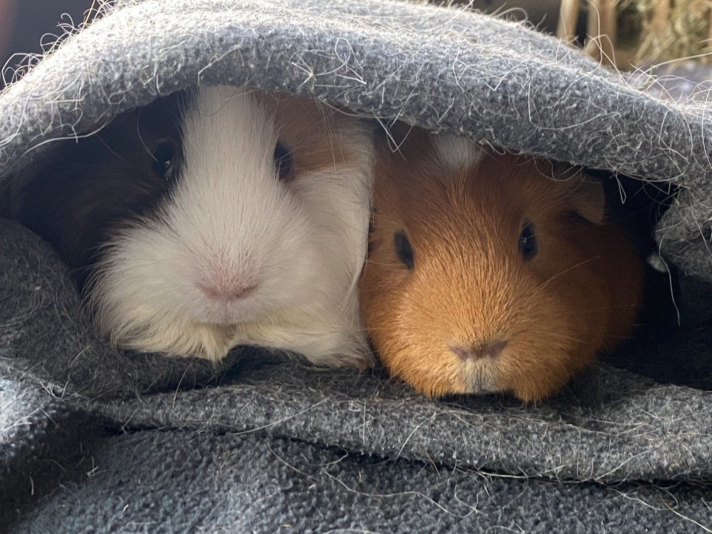

The is the first time in a while I've done an expanded yearly review! I usually do a small one on my [instagram](https://www.instagram.com/apricot13).

I know 2020 was a hard year for a lot of people and it did have some down sides for me too but for the most part it was a really good year. 

The amount of events this year was pretty low but the quality of each more than made up for it.

* We found Bert (or more accurately Bert chose us!) 
* we went away a few times (before it all kicked off) 
* I started a new job with a company and with people who are genuinely kind and sincere (which is in part why I'm more open about my mental health now) 
* I played an ungodly amount of animal crossing! 
* I finally completed a large amount of my "hidden to-do list" (those tasks that you know are there but you don't write them down - craft projects were my main culprits!)
* We bought a new car, a hybrid Hyundai - its beautiful and practically drives for you!

My mental health did suffer though this year - being stuck at home all day is kind of the dream for me but the changes in the routines of life really affected me. Things I was able to force myself to do before suddenly became difficult as the routines had changed. As someone who can't just "go out"  I realised how exhausted I was from forcing myself to go and do things when I was commuting, despite all the precautions I took to avoid crowds or stressful situations. 

I had made a lot of progress in the beginning of the year with support from my doctors but towards the end of the year I didn't have that level of support anymore and the only thing keeping me from giving in to my fears and panic attacks is my stubbornnes and support from my ever patient partner.

I read a lot of books in 2020 one of the best ones was Viktor Frankl's Man's search for meaning. I dislike twee quotes but this one sums up the book so well. Though to really understand it you should definitely give it a read. 

> "Everything can be taken from a man but one thing: the last of the human freedoms-to choose one's attitude in any given set of circumstances"

**January 2020** 

We started off the year going outside, such a strange concept now but we went to visit the Tutankhamun exhibition for Nicks birthday.

Fresh from losing my Bozpig just before christmas we had started looking for a companion for Arthur. He was a super sad pig while on his own but he also came out of his shell a little during his time alone. Boz was my baby but he was also a bit of a bully. It took a while to hear back from the rescues but we went piggie dating in Jan! We came home with Bert. Albert Montgomery Malteser to use his full name. (Arthur is Arthur Wellesley obviously!) Arthur is now a whole new pig. 

**February 2020**

February was the month of travel!

We went on a surprise weekend away to Rye and Dungeoness. First thing I did was get in that bath and watch TV!  

At the end of the month we went up to Manchester to see back to the future. We made the most of it so much good food!

**March 2020**

From here on out things get a bit blurred! 😂 

I started work on my project to learn all the new pokemon (happy to send over the anki deck if anyone wants it

I finally finished my pi-grrl2

