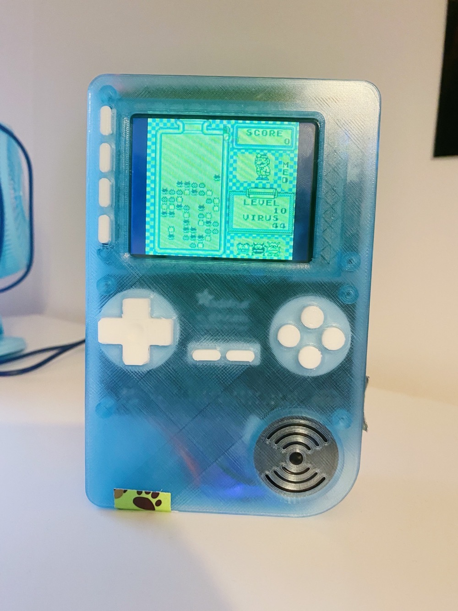
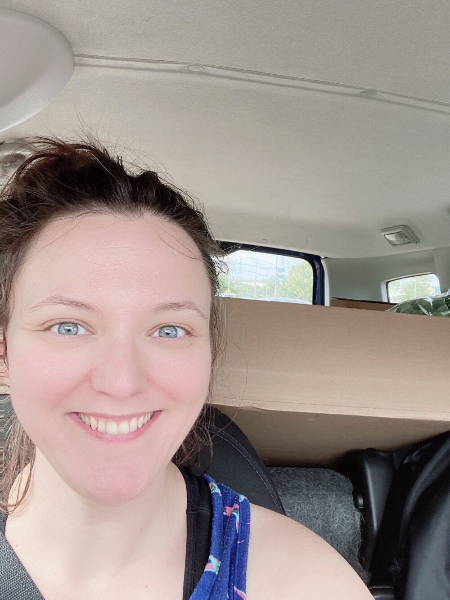
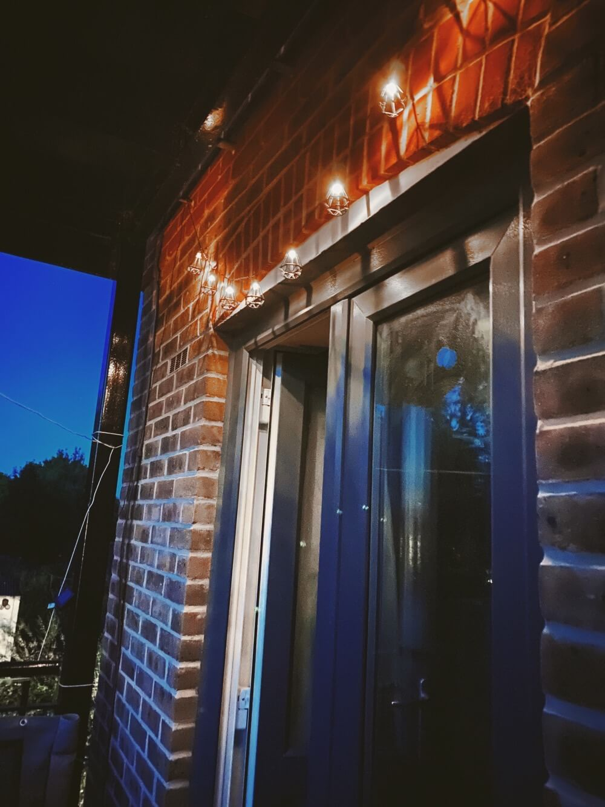
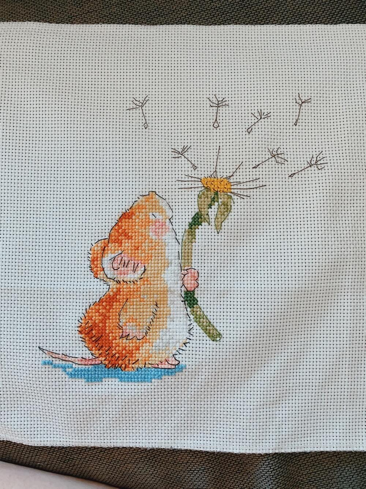
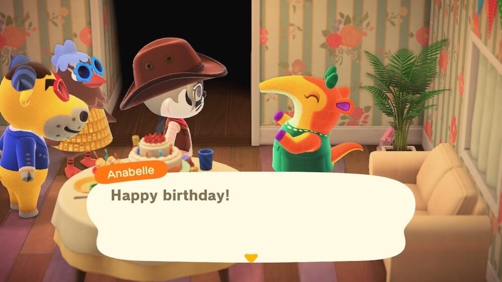
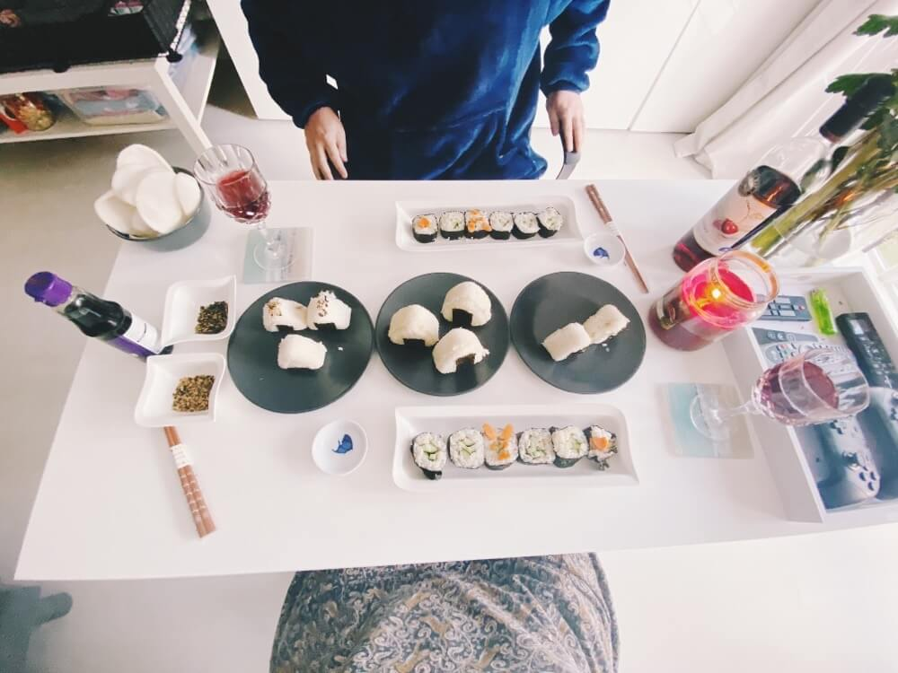
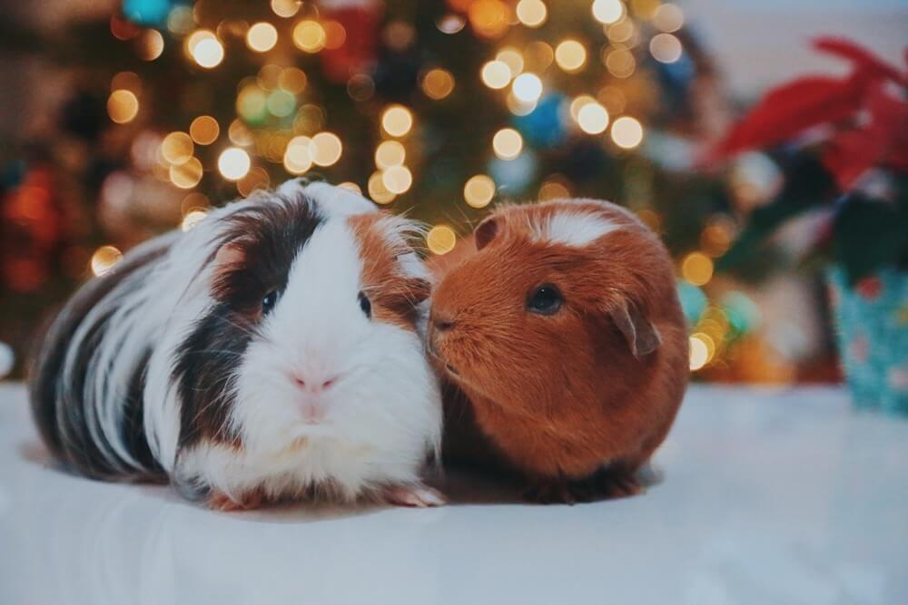

This is a long one!
The is the first time in a while I've done an expanded yearly review! I usually do a small one on my [instagram](https://www.instagram.com/apricot13).

I know 2020 was a hard year for a lot of people and it did have some down sides for me too but for the most part it was a good year to me. The amount of events this year was pretty low but the quality of each more than made up for it.

Some highlights of the year:

* We found Bert (or more accurately Bert chose us!) 
* We managed to go away a few times (we were so lucky with timings each time)
* I started a new job with a company and with people who are genuinely kind and sincere 
* I played an ungodly amount of animal crossing! 
* I finally completed a large amount of my "hidden to-do list" (those tasks that you know are there but you don't write them down - craft projects were my main culprits!)
* We bought a new car, a hybrid Hyundai Kona  - its beautiful and practically drives for you!
* I got to know out local area a lot more. We're so lucky to live in an area where five minutes from the busy high street theres fields and fields of open space

On the slightly negative side my mental health did suffer this year - being stuck at home all day is kind of the dream for me but the changes in the routines of life really affected me. Not being able to do things as regularly as I used to meant I became out of practice. Things I was able to force myself to do before suddenly became difficult as the processes had changed. 

As someone who can't just "go out" I realised how exhausted I was from forcing myself to go and do things before when I was commuting, despite all the precautions I took to avoid crowds or stressful situations. 

I read a lot of books in 2020 one of the best ones was Viktor Frankl's Man's search for meaning you really have to read the book to get the full meaning because on its own its a bit cheesy.

> "Everything can be taken from a man but one thing: the last of the human freedoms-to choose one's attitude in any given set of circumstances"

**January 2020** 

We started off the year going outside, such a strange concept now but we went to visit the Tutankhamun exhibition for my other halfs birthday.

Fresh from losing my Bozpig just before christmas we had started looking for a companion for Arthur. He was a super sad pig while on his own but he also came out of his shell a little during his time alone. Boz was my baby but he was also a bit of a bully. It took a while to hear back from the rescues but we went piggie dating in Jan! We came home with Bert. Albert Montgomery Malteser to use his full name. (Arthur is Arthur Wellesley obviously!) Arthur is now a whole new pig. 

**February 2020**

February was the month of travel!

We went on a surprise weekend away to Rye and Dungeoness. First thing I did was get in that bath and watch TV!  

At the end of the month we went up to Manchester to see back to the future. We made the most of it so much good food!

**March 2020**

From here on out things get a bit blurred! 😂 

I started work on my project to learn all the new pokemon (happy to send over the anki deck if anyone wants it I dont think I can offer it for download for copywrite reasons)

I finally finished my [pi-grrl2](https://learn.adafruit.com/pigrrl-2)  a project I started buying components for in 2018?! Along with a lot of other little raspberry pi projects I'd been wanting to finish for a while.

I started trying to run. I don't know what possessed me but I was at that point where I was going stir crazy enough to consider it. I know a lot of people say it helps their mind unwind but I get that from walking! I tried out the Nike run app coach and did not enjoy that one bit they don't seem to have considered that an absolute beginner has no stamina!

**April, April 2020**

Lots of sitting on the balcony reading. Some IKEA trips and more animal crossing!

**May, June, July 2020**

The first time I'd worn makeup since February! A 50's inpsired zoom quiz night.

I also made the Dalgona coffee that was all the rage and we did some more walks.

I started working on craft projects, a painting by numbers and one of those hook latch kits.

We visited my parents for the first time in 2020 (outside ofc!)

We started decorating the balcony with some flowers and solar lights and a guinea pig statue!

I started playing elderscrolls online and sea of thieves.

**August 2020**

I did my first ever cross stitch and I realised how messed up my hands really are!

Another IKEA trip! And more reading on the Balcony.

I started my new job! 🎉

I finally finished digitising and shredded all of my old paperwork! I had to buy a new shredder to finish the task!

**September 2020**

Arthur started peeing blood so a series of trips to the vets began. Standing outside the surgery then handing them over and then getting them delivered back to you in your car was so strange. 

We bought a new car!! We loved the smart but we needed something bigger so we went wayy over the top and bought a hybrid SUV. Hyundai Kona. 

The second visit to my parents of the year! Outside again.

**October 2020**

My birthday!! We couldn't do a lot because of lockdown but I did get a colin the caterpillar cake!!

I decided we should have a full on homemade sushi meal! 

I finally upgraded my iPad, and my phone and keyboard and mouse. I now have a business account with apple 😬 

It wouldn't be october without my annual donut - the halloween krispy kremes!

We were so lucky to still be able to go away for a break to Saxmundham at the end of October. We got in just before the next lockdown.

Arthur had an extended stay at the specialist vets while we were away to have daily fluid injections to help flush through his kidney and bladdar stones. They're still there but the sludge has decreased. We're monitoring him and keeping him nice and fat and making sure he drinks!

**November 2020**

I became briefly obsessed with 100%-ing xbox games, managed three in a row before I went back to animal crossing!

We added LED lights under the sofa. best decision ever. 

!(sofa led's)[3A88955B-468B-435E-A376-424EC2B08ABF.jpeg]

**December 2020**

I had a virtual christmas party with zoom bingo, a zoom comedian and an interactive spooky house thing (that I didnt do because I'm a wimp) the office sent us cocktails and snacks to accompany the party!

More animal crossing

I finally did my piggie photoshoot for the years christmas card!

My secret lab gaming chair arrived. I still dont like the look of them but I have so many neck issues I'll do anything to avoid another migraine!