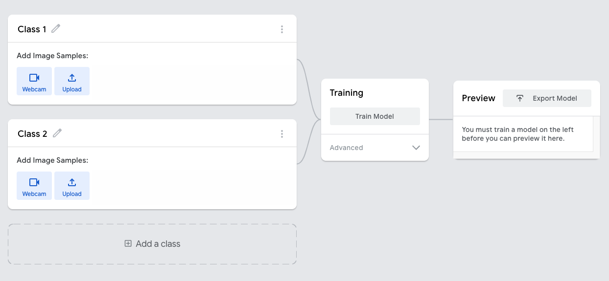

I recently put together a little section in a workshop on machine learning for beginners and thought I would write up my notes here for others.

For the workshop the outcome was to **train a model** and **apply a model** on some provided images. No knowledge of coding was required! We're using [tensorflow.js](https://www.tensorflow.org/js).

## Training the model

To train the model we're using [teachable machine](https://teachablemachine.withgoogle.com/) its a great tool that you can train with images, sounds and poses! 

Open up this link and you'll see a screen with two classes on the left.



This exercise is based around binary classification (or if you upload multiple classes - multi-class classification). A machine learning algorithm uses two data sets of labeled (pre-identified) images in order to learn the differences between them and how to identify future images it may be exposed to.

In the teachable machine I'm uploading 5-10 images of my guinea pigs into one class, I'm imaginatively naming it `Is guinea pig` and the other will be `Is not guinea pig`. [Kaggle](https://www.kaggle.com/) is a great resource for finding images to train your algorithm with. 

Click the 'train' button to train your algorithm.  Underneath the button there are also advanced options to adjust how your algorithm learns. If your interest in learning a lot more on these terms definitely check out Googles [introduction to machine learning course](https://developers.google.com/machine-learning/crash-course/ml-intro). 

The **Epochs** is the number of times your set of images (**training samples**) are run through the machine. A number 50 in here means your modeal with work through the entire set of images 50 times. 

**Batch size** is the number of images run through each training iteration. 100 images with a batch size of 20 means there will be 5 batches of data (100 / 20) - once each of these batches is complete this will be one **epoch**.

Once your algorithm is trained you can upload a file or use your webcam to test it with new images it hasn't seen before.

The next step in this exercise is to export your model. Click the 'Export Model' button and then click 'Upload my model' **save the sharable link that it generates for later**!


## Applying the model

To apply the model we will be creating a little website that you and others can upload images to to test your algorithm.

You can skip all the below steps and simply try out my trained (on guinea pigs) algorithm [here](https://glitch.com/~fg-basic-ml-example). If you want to use your own uploaded algorithm from above click the 'remix your own' button on that page. Open the `script.js` file on the left hand side and update the url next around line ~43. 

```js
const ourModel = "https://teachablemachine.withgoogle.com/models/av5gK3anQ/";
```


If your following along you can build your own version of this yourself!

Visit this page and click [Remix your own](https://glitch.com/~fg-ml-base) or [click this link](https://glitch.com/edit/#!/remix/fg-ml-base) and it will generate it for you!

We will only be working in two files `index.html` and `script.js`. All the code snippets you will need are [here](https://gist.github.com/apricot13/dde8789027979bf62ae0fba8cfa50532). If you get stuck at any point remember you can [look at the code for the example version](https://glitch.com/~fg-basic-ml-example) or scroll to the bottom of the [github page](https://gist.github.com/apricot13/dde8789027979bf62ae0fba8cfa50532) and the full code is there. 

---

Firstly we will need to give your page a title, the first code you will need to copy is the title.

*index.html*

```html
<h1>Is it a .... ?</h1>
```

Update the title depending on what you're algorithm was trained on.

---

Once the page has a title people need to choose their image so we can work out what it is! 

*index.html*

```html
<!-- Step 1 - we need people to be able to choose their image -->
<div class="test-image">
  <input type="file" id="testImage" onchange="onFileSelected(event)" />
</div>
```

They're probably like me and forget which image they chose so we want a place where we can show them this image.

*index.html*

```html
<!-- when someone uploads the image we show it on the page -->
<div class="preview-image hidden" id="preview-image">
  
</div>
```

This file upload has an onchange attribute on it. When there is a change (image selected) then it runs the function `onFileSelected(event)`.

*script.js*

```js
/**
  This function runs when the the file field receives an input.
*/

function onFileSelected(event) {
  // show the image box
  showHide("preview-image", true);

  // get the first file uploaded
  var selectedFile = event.target.files[0];

  // use the FileReader api to do magic
  // more info here: https://developer.mozilla.org/en-US/docs/Web/API/FileReader
  var reader = new FileReader();

  // get the img tag which will soon display our image on the page
  var imgtag = document.getElementById("myImage");
  // set the title="" attrubute on the img tag to the file name
  imgtag.title = selectedFile.name;

  // The onload event is triggered each time the reading operation is successfully completed.
  reader.onload = event => {
    // set the src="" to the result - in this case the image is converted into a base64 string
    // read more here: https://css-tricks.com/data-uris/
    imgtag.src = event.target.result;
  };

  // reads the contents of the file - this triggers the function above
  // Starts reading the contents of the specified Blob, once finished, the result attribute contains a data: URL representing the file's data.
  reader.readAsDataURL(selectedFile);
  
  // hide the results box if its been submitted already
  showHide("results", false);
}
```

So now when you select your image you get a preview on the page.

---

The next stage is to actually submit the image and run it through the algoritm.

*index.html*

```html
<!-- a button to make it all happen -->
<button id="identifyBtn" onclick="init()">
  Identify
</button>
```

This is the submit button, you can change the word identify to anything you like. This has an onclick button on it which runs a function called `init()`, which we will write next!

*script.js*

```js
/**
This function is run when you click the 'Identify' button
*/
async function init() {
 
}
```

---

Now that we have a submit button that is linked to the `init()` function we will need to add in a loading indicator so the user knows we're doing something in the background.

*index.html*

```html
<!-- show a loader -->
<div id="loading" class="hidden rotate">🐹</div>
```

This loading div is hidden by default. In our `init()` method we will show it when we click the submit button.

*script.js (within `init()` curly braces)*

```js
// We need to show we're loading something unhide the loading hamster
  showHide("loading", true);
```

add this and all the following code (until told otherwise) in between the curly braces of the `init()` function. Like so.

```js
/**
This function is run when you click the 'Identify' button
*/
async function init() {

// code goes here
 
}
```

---

After we show the loader we need to initialise the model. This is where your previously uploaded model url will be used.

*script.js (still within `init()` curly braces)*

```js
// Our trained image url
  const ourModel = "https://teachablemachine.withgoogle.com/models/av5gK3anQ/";

  const modelURL = ourModel + "model.json";
  const metadataURL = ourModel + "metadata.json";
  model = await tmImage.load(modelURL, metadataURL);
```

Update the url with your own or leave it to check for guinea pigs!

---

We then need to send the image over to the library, it requires the image in a specific format so i've jumped through a few hoops here to do that. You can read more about the library we're using [here](https://github.com/googlecreativelab/teachablemachine-community/tree/master/libraries/image). 

*script.js (still within `init()` curly braces)*

```js
const testImage = document.getElementById("myImage").src;
  var myImage = new Image();
  myImage.src = testImage;

  await prediction(myImage);
```

All the magic happens in the `prediction()` method but before we write that when the results come back we need to hide the loading hamster and show the results div on the page.

*script.js (still within `init()` curly braces)*

```js
showHide("loading", false);
showHide("results", true);
```

*index.html*

```html
<!-- we need somewhere for results to go -->
      <div class="results hidden" id="results"></div>
```

---

Now we're done with the `init()` function so you can type the following outside of the curly braces.

*script.js*

```js
async function prediction(image) {
  const prediction = await model.predict(image);
  const results = document.getElementById('results');
  // clear the results box from any previous run throughs
  const results = document.getElementById('results');
   prediction.map((myClass, i)=> {  
     results.append(`${myClass.className}: ${myClass.probability.toFixed(2)}\n\n`)
  })
  
}
```

*Where to place this last bit*

```js
/**
This function is run when you click the 'Identify' button
*/
async function init() {

// code you've written so far
 
}

// this new piece of code goes here!
```

---

And thats it - here is the final code

*index.html*

```html
<h1>Is it a .... ?</h1>

<!-- Step 1 - we need people to be able to choose their image -->
<div class="test-image">
  <input type="file" id="testImage" onchange="onFileSelected(event)" />
</div>

<!-- when someone uploads the image we show it on the page --> 
<div class="preview-image hidden" id="preview-image">
  
</div>
  
<!-- a button to make it all happen -->
<button id="identifyBtn" onclick="init()">
  Identify
</button>

  
<!-- show a loader -->
<div id="loading" class="hidden rotate">🐹</div>

<!-- we need somewhere for results to go -->
<div class="results hidden" id="results"></div>
    
    
    
<!--      
<script src="https://cdn.jsdelivr.net/npm/@tensorflow/tfjs@1.3.1/dist/tf.min.js"></script>
<script src="https://cdn.jsdelivr.net/npm/@teachablemachine/image@0.8/dist/teachablemachine-image.min.js"></script>
 -->
```

*script.js*

```js
/**
  This function runs when the the file field receives an input.
*/

function onFileSelected(event) {
  // show the image box
  showHide("preview-image", true);

  // get the first file uploaded
  var selectedFile = event.target.files[0];

  // use the FileReader api to do magic
  // more info here: https://developer.mozilla.org/en-US/docs/Web/API/FileReader
  var reader = new FileReader();

  // get the img tag which will soon display our image on the page
  var imgtag = document.getElementById("myImage");
  // set the title="" attrubute on the img tag to the file name
  imgtag.title = selectedFile.name;

  // The onload event is triggered each time the reading operation is successfully completed.
  reader.onload = event => {
    // set the src="" to the result - in this case the image is converted into a base64 string
    // read more here: https://css-tricks.com/data-uris/
    imgtag.src = event.target.result;
  };

  // reads the contents of the file - this triggers the function above
  // Starts reading the contents of the specified Blob, once finished, the result attribute contains a data: URL representing the file's data.
  reader.readAsDataURL(selectedFile);
  
  showHide("results", false);
}

/**
This function is run when you click the 'Identify' button
*/
async function init() {
  // We need to show we're loading something unhide the loading hamster
  showHide("loading", true);

  // Our trained image url
  const ourModel = "https://teachablemachine.withgoogle.com/models/av5gK3anQ/";

  const modelURL = ourModel + "model.json";
  const metadataURL = ourModel + "metadata.json";
  model = await tmImage.load(modelURL, metadataURL);
  maxPredictions = model.getTotalClasses();

  const testImage = document.getElementById("myImage").src;
  var myImage = new Image();
  myImage.src = testImage;

  await prediction(myImage);

  showHide("loading", false);
  showHide("results", true);
}

async function prediction(image) {
  const prediction = await model.predict(image);
  const results = document.getElementById('results');
  // clear the results box from any previous run throughs
  const results = document.getElementById('results');
  results.innerHTML = '';
   prediction.map((myClass, i)=> {  
     results.append(`${myClass.className}: ${myClass.probability.toFixed(2)}\n\n`)
  })
  
}

/**
Show / Hide things
*/
// function showHide(id, show) {
//   if(show === true)
//     document.getElementById(id).classList.remove('hidden');
//   else 
//     document.getElementById(id).classList.add('hidden');
// }
```

---

Theres so much more you can do with machine learning here is some further reading!

[Neural networks by 3Blue1Brown](https://www.youtube.com/playlist?list=PLZHQObOWTQDNU6R1_67000Dx_ZCJB-3pi) - great video series on neural networks, recommend all their videos tbh!

[Hello World](http://www.hannahfry.co.uk/helloworld) by Hannah Fry - keeps popping up though I haven't read it myself! But if its anything like her TED talks it will be brilliant (and understandable!)

[Machine Learning for Absolute Beginners: A Plain English Introduction](https://www.amazon.co.uk/gp/product/B07335JNW1?&linkCode=ll1&tag=e09d-21&linkId=40201a6ebae9b64f42934e2c64977faa&language=en_GB&ref_=as_li_ss_tl) - I picked this up on kindle for 99p and so far I'm enjoying it.
